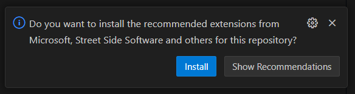

# BlogCentral Service

This service is responsible for managing the blog posts and comments.

## Table of Contents

- [Getting Started](#getting-started)
  - [Prerequisites](#prerequisites)
  - [Installing](#installing)
- [Scripts](#scripts)
  - [Linter and Formatter the code](#linter-and-formatter-the-code)
- [Authors](#authors)

## Getting Started

These instructions will get you a copy of the project up and running
on your local machine for development and testing purposes.

### Prerequisites

What things you need to install the software and how to install them.

1. Visual Studio Code - [Download](https://code.visualstudio.com/)
2. Node.js (v20.15.0) - [Download](https://nodejs.org/en/blog/release/v20.15.0)

### Installing

A step by step series of examples that tell you how to get a development env running.

1. Install required extensions for Visual Studio Code

   Click on the install button for installing the required extensions.

   

2. Install the dependencies

   Run the following command to install the dependencies:

   ```bash
   npm install
   ```

## Scripts

### Linter and Formatter the code

```bash
# Check the code
npm run lint

# Fix the code
npm run lint:fix
```

## Authors

- Ratchapol Thongta - [@ratchapoltt](https://www.github.com/ratchapoltt)
